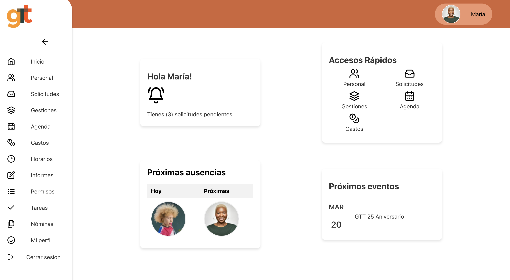
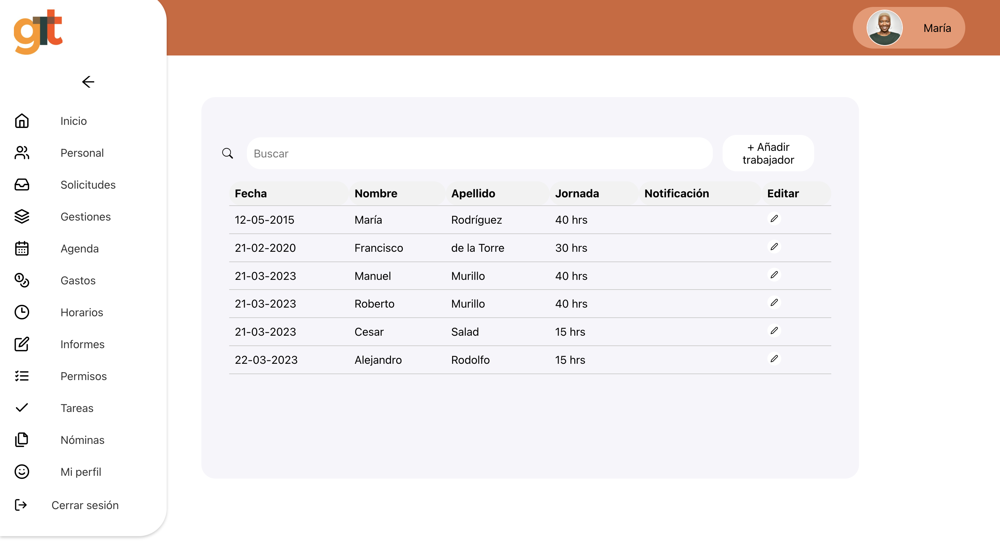
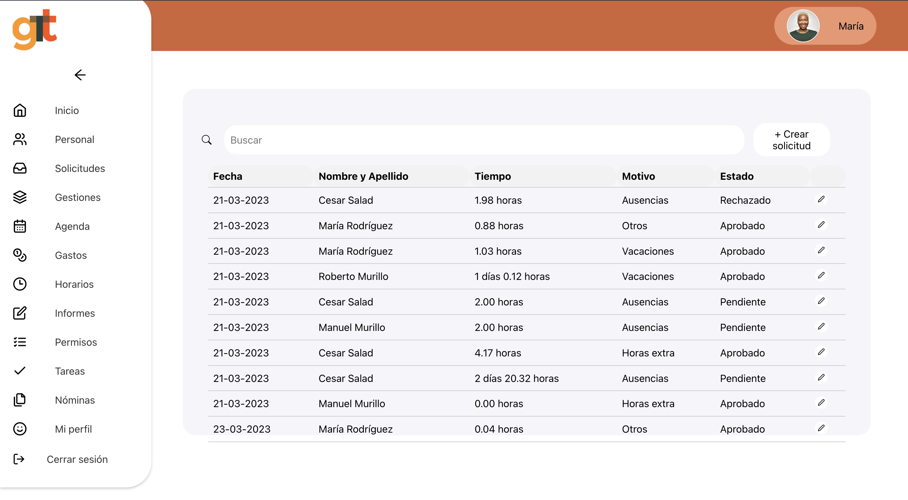
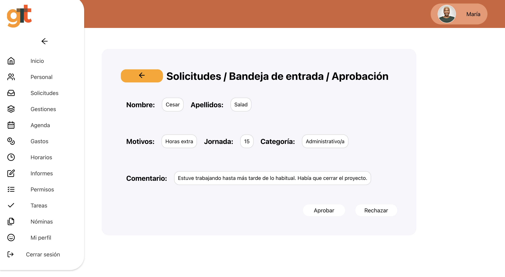
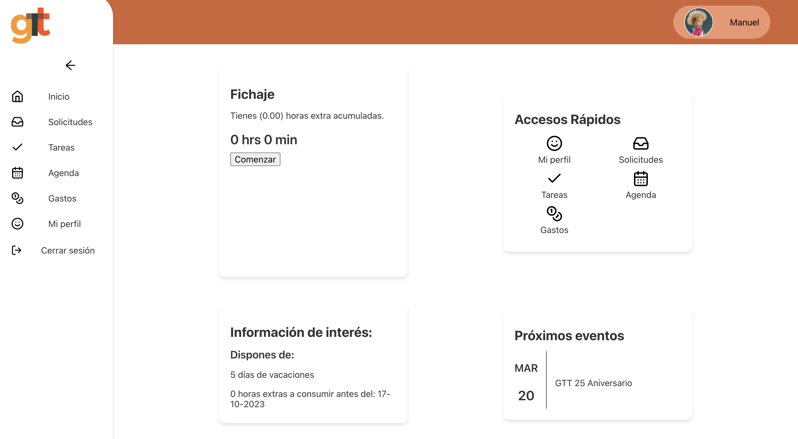

# gTt-VIH-hr-manager-app

Aplicación de recursos humanos para el Grupo de Trabajo sobre Tratamientos de VIH.

Se trata de una web app para la gestión de los empleados, su fichaje, las horas extras y otras solicitudes con autenticación y roles de usuario y administrador.

 

## Realizada con el STACK PERN:

- PostgresSQL
- Express
- ReactJS
- Node.js

 

## Otras tecnologías utilizadas:

- Sequelize ORM
- Json Web Token
- Bcrypt
- React Router Dom
- Context
- Nuevo enfoque de Redux (New Redux Approach)
- SASS

 

 

## Funcionalidades implementadas:

- Autenticación basada en roles utilizando tokens en el lado del servidor y con peticiones del lado del cliente.

- Persistencia de la sesión de usuario.

- Protección de rutas.

- Operaciones CRUD (Crear, Leer, Actualizar y Eliminar) de empleados para el administrador.

- Información de usuario (admin o empleado) mostrada por toda la pantalla.

- Funcionalidad de fichaje de jornada laboral.

- Automatización de la solicitud de horas extra tras finalizar jornada.

- Creación de solicitudes de otros tipos.

- Capacidad de aprobar o rechazar solicitudes pendientes.

- Despliegue con Docker [aquí](https://gtt-vih-hrm.onrender.com/) 
.

 

 

 

 

